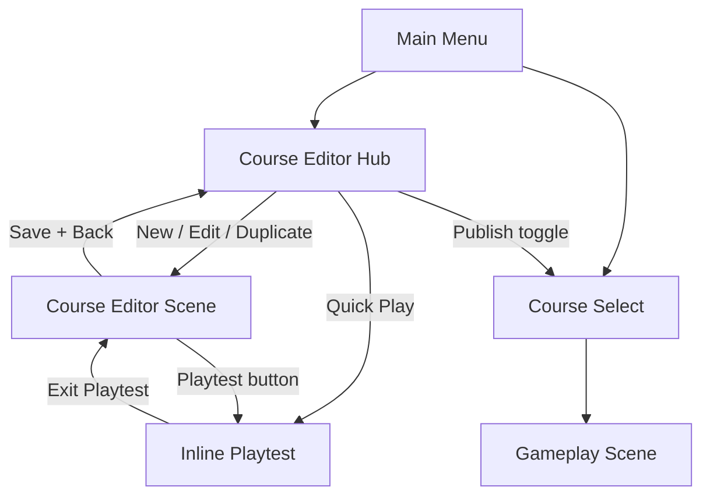

# Player Course Editor — Design Spec

**Date:** 2026-05-30  
**Status:** Approved  
**Supersedes (authoring surface only):** §2 and §8 of `2026-05-30-course-editor-design.md`  
**Audience:** Casual players (primary); power users tolerated via progressive disclosure  
**Scope:** Full in-game course editor reachable from Main Menu — no Unity EditorWindow or Scene-view dependency for players  

---

## 1. Executive Summary

Replace the split Unity Editor window + Scene view workflow with a **single full-screen in-game editor** that casual players can discover from the Main Menu, learn in under ten minutes, and use to build complete disc golf holes without opening the Unity Editor.

The editor retains **full depth**: surface painting, elevation sculpting, water/OB hazards, tee and basket placement, foliage props, theme selection, validation, save/load, and one-tap playtest — all backed by the existing `HoleData` JSON schema, `CourseBuilder`, and `CourseValidator`.

Design patterns are borrowed from proven course creators:

| Source | Pattern adopted |
|--------|-----------------|
| **Golf It!** | Main-menu “Editor” entry; template-based new holes; name-before-edit |
| **PGA TOUR 2K23** | Hole-first workflow; unified dashboard; theme + lighting; publish-to-play loop |
| **The Golf Club 2019** | Brush size + softness controls; sculpt-before-surfaces guidance; camera lighting toggle |
| **Disc Golf Valley** | In-game creator for the same sport; publish and play with identical rules |
| **Parkdly / UDisc** | Click-to-place mental model; hole tabs; plain-language distances and OB labels |

Unity Editor tools (`CourseEditorWindow`, `CourseEditorOverlay`) remain as **developer shortcuts** but are not part of the player path.

---

## 2. Design Principles (Casual-First, Full Depth)

### 2.1 Principles

| # | Principle | Implementation |
|---|-----------|----------------|
| P1 | **One canvas** | All editing happens in Game view with a single HUD — never “paint elsewhere.” |
| P2 | **Show, don’t document** | Every tool has a one-line coach mark + live preview (brush ring, hazard fill, elevation contour). |
| P3 | **Hole-first** | Guided flow: name → tee → fairway → basket → green → optional hazards → playtest. |
| P4 | **Progressive disclosure** | Default tool dock shows 6 core tools; “More tools” expands elevate, foliage, theme, advanced. |
| P5 | **Forgiving** | Undo/redo always visible; autosave every 30 s; “Revert to last save” on Hub card. |
| P6 | **Same game, same rules** | Playtest uses identical throw HUD, hazard penalties, and flight as Course Select gameplay. |
| P7 | **Plain language** | Validation messages rewritten for players (“Place the basket on the green” not `E004`). |
| P8 | **Templates beat blank grids** | New users never start from an empty 40×120 grid without a coach overlay. |

### 2.2 Non-Goals (this spec)

- Cloud hosting, multiplayer sync, or Steam Workshop (local + file share only for v1).
- Freeform mesh sculpting (stay on 2 m tile grid + height grid).
- Procedural hole generation.
- In-editor disc flight tuning per hole.
- Replacing Parkdly/UDisc for real-world course mapping.

---

## 3. Navigation & Scene Architecture

### 3.1 Scene graph (player build)

Add two scenes to `EditorBuildSettings` (after Settings, before gameplay):

```
Intro → MainMenu → { CharacterSelect, CourseSelect, CourseEditorHub, Settings }
CourseEditorHub → CourseEditor (edit/play mode, same scene)
CourseSelect → Gameplay (JSON hole or legacy PrototypeFlat3)
```

| Scene | Load name | Purpose |
|-------|-----------|---------|
| `CourseEditorHub.unity` | `CourseEditorHub` | Library: my holes, templates, import |
| `CourseEditor.unity` | `CourseEditor` | 3D edit + inline playtest (rebuilt for runtime HUD) |

`SceneFlow` additions:

```csharp
public const string CourseEditorHub = "CourseEditorHub";
public const string CourseEditor = "CourseEditor";
```

### 3.2 Main Menu change

Add button **Course Editor** between Course Select and Settings (same visual style as existing menu buttons from `MenuSceneBuilder`).

Label alternatives considered: “Create Course”, “Course Builder”. **Chosen: “Course Editor”** — matches Golf It! and player expectation.

First launch: optional **“New here? Take the 5-minute tour”** banner on Hub (dismissible, stored in `PlayerPrefs`).

### 3.3 Information architecture



---

## 4. Course Editor Hub (Library Screen)

### 4.1 Layout

Full-screen menu canvas matching Main Menu palette (`BgColor` `#142311`, accent `#47C75C`).

```
┌──────────────────────────────────────────────────────────────────┐
│  ← Main Menu          COURSE EDITOR                              │
├──────────────────────────────────────────────────────────────────┤
│  [ + New Hole ]   [ Import File ]   [ ? How It Works ]           │
├──────────────────────────────────────────────────────────────────┤
│  MY HOLES                                                        │
│  ┌────────────┐  ┌────────────┐  ┌────────────┐                 │
│  │ [minimap]  │  │ [minimap]  │  │ [minimap]  │                 │
│  │ Ridgeline  │  │ Pond Par 3 │  │ Untitled   │                 │
│  │ Par 3 ·247yd│  │ Draft      │  │ Par 3      │                 │
│  │ [Edit][▶]  │  │ [Edit][▶]  │  │ [Edit]     │                 │
│  │ [Publish ○]│  │ [Publish ●]│  │            │                 │
│  └────────────┘  └────────────┘  └────────────┘                 │
├──────────────────────────────────────────────────────────────────┤
│  TEMPLATES                                    (scroll row)       │
│  [ Blank Par 3 ] [ Dogleg Left ] [ Island Green ] [ Ridgeline ]  │
└──────────────────────────────────────────────────────────────────┘
```

### 4.2 Hub actions

| Action | Behavior |
|--------|----------|
| **New Hole** | Opens **New Hole wizard** (§5) — never drops directly into blank editor without naming. |
| **Import File** | Native file picker (`.json`) → copy to `persistentDataPath/Courses/` → open in editor. |
| **Edit** | Load hole into `CourseEditor` scene. |
| **▶ Quick Play** | Validate → if OK, load editor scene directly in playtest mode (skip edit UI). |
| **Publish toggle** | When ON, hole appears in **Course Select → My Courses** tab. OFF = draft only. |
| **Duplicate** | Long-press or overflow menu → copy JSON with `_copy` suffix. |
| **Delete** | Confirm modal; moves to trash folder (recoverable 7 days) rather than hard delete. |

### 4.3 Thumbnails

On save, capture orthographic minimap render (reuse `MinimapUI` framing logic) → PNG beside JSON (`hole_01.thumb.png`). Hub cards show thumbnail, name, par, yardage, last-edited date, publish state.

### 4.4 Storage layout

| Location | Content |
|----------|---------|
| `StreamingAssets/Courses/Templates/` | Shipped templates (read-only) |
| `StreamingAssets/Courses/Examples/` | `hole_01.json` Ridgeline demo |
| `Application.persistentDataPath/Courses/` | User saves `{id}.json` + `{id}.thumb.png` + `{id}.meta.json` |
| `persistentDataPath/Courses/.trash/` | Soft-deleted holes |

`meta.json` stores: `displayName`, `published`, `lastEditedUtc`, `templateSource`, `playCount` (optional analytics local-only).

---

## 5. New Hole Wizard (Casual Onboarding)

Golf It! pattern: **choose template and name before entering 3D.**

### 5.1 Steps (modal overlay on Hub)

**Step 1 — Name your hole**

- Text field: default “My Par 3”
- Subtitle: “You can change this anytime.”

**Step 2 — Pick a starting layout**

| Template | Description | Starting content |
|----------|-------------|------------------|
| **Blank Par 3** | Empty fairway strip, 40×80 grid | Tee row + rough border only |
| **Straight Par 3** | ~250 yd corridor (default starter) | Pre-painted fairway, tee, basket placeholders at ~250 yd spacing |
| **Dogleg Left** | Bend at 150 yd | Fairway L-shape + rough |
| **Island Green** | Water wraps green | Water hazard pre-placed (editable) |
| **Ridgeline** | Clone of `hole_01.json` | Full example hole |

Visual: large preview thumbnail per template (not text-only).

**Step 3 — Choose look (theme)**

- Carousel of 1–3 theme cards (v1: Temperate only; UI ready for Florida etc.)
- Copy: “Trees and grass style — you can change later.”

**Step 4 — Start**

- Primary: **Start Building** → `CourseEditor` with **First-Run Coach** active (§6)
- Secondary: **Skip tutorial** (sets `PlayerPrefs` `course_editor_tutorial_done`)

---

## 6. First-Run Coach (In-Editor Tutorial)

Disc Golf Valley / PGA “place first hole” pattern adapted to disc golf tile workflow.

### 6.1 Coach steps (non-blocking checklist, top-right)

Checklist panel (collapsible):

1. ☐ **Paint the fairway** — auto-complete when fairway tile count ≥ 10  
2. ☐ **Place the tee** — Tee tool, one click  
3. ☐ **Place the basket** — Basket tool, on green  
4. ☐ **Paint the green** — green tiles around basket  
5. ☐ **Try a hazard** (optional) — any closed water or OB polygon  
6. ☐ **Play your hole** — complete one playtest throw  

Each step: pulsing highlight on relevant dock icon + 1-sentence tooltip. Completing step checks box with satisfying chime (reuse callout SFX if available).

### 6.2 Contextual coach marks

When a tool is selected for the first time ever, show **3-second banner** at bottom of context strip (e.g. “Drag across the ground to paint fairway tiles”).

Stored in `PlayerPrefs` per tool: `coach_paint_seen`, etc.

---

## 7. Course Editor Scene — Master Layout

### 7.1 Screen regions

```
┌─ TOP BAR (56px) ─────────────────────────────────────────────────────────┐
│ [← Hub]  Hole Name ✎   Par [3▼]   247 yd   ⚠ 1   [Undo][Redo] [Save] [▶] │
├─ LEFT RAIL (72px, optional collapse) ────────────────────────────────────┤
│ Camera: [Overview][Tee][Basket][Top-Down]                                   │
├─ MAIN VIEWPORT (flex) ───────────────────────────────────────────────────┤
│                                                                           │
│   3D course (live baked mesh) + grid overlay + tool previews              │
│                                                                           │
├─ VALIDATION DRAWER (collapsed by default, expands on tap of ⚠) ──────────┤
├─ TOOL DOCK (80px) ───────────────────────────────────────────────────────┤
│ Paint | Erase | Tee | Basket | Hazard | More ▼                            │
├─ CONTEXT STRIP (64px, tool-specific) ────────────────────────────────────┤
│ [Fairway][Rough][Green][Tee tile]  Brush: ●○○○                            │
└───────────────────────────────────────────────────────────────────────────┘
```

**More ▼** expands second row: **Elevate | Trees | Theme | Hole Info**

Matches PGA dashboard (persistent tools) + TGC paginated advanced tools (second row, not separate window).

### 7.2 Top bar details

| Control | Behavior |
|---------|----------|
| **← Hub** | If dirty, “Save changes?” modal (Save / Discard / Cancel) |
| **Hole Name ✎** | Inline edit modal |
| **Par dropdown** | 3, 4, 5 — updates validation only (yardage still computed) |
| **247 yd** | Live tee→basket distance; tap opens Hole Info panel |
| **⚠ N** | Error/warning count; tap expands validation drawer |
| **Undo / Redo** | Runtime command stack (§14) |
| **Save** | Write JSON + thumbnail; toast “Saved” |
| **▶ Playtest** | §10 |

### 7.3 “More tools” expanded state

| Tool | Icon label | Context strip |
|------|------------|---------------|
| Elevate | ⛰ Elevate | Radius slider 1–5, Strength 0.05–1 m, Smooth toggle, “Hold Shift to lower” hint |
| Trees | 🌲 Trees | Archetype carousel (tree_round, tree_tall, bush_low), Place / Erase tree, Rotate |
| Theme | 🎨 Theme | Theme card picker → live rebake |
| Hole Info | ℹ Info | Circle radius, theme id read-only, stats (tile count, tree count, JSON size) |

---

## 8. Tool Specifications

Shared authoring logic moves to **`Assets/Scripts/CourseEditor/Authoring/`** (runtime-safe). Editor overlay becomes thin wrapper calling same API.

### 8.1 Paint

**Competitive pattern:** TGC surface hierarchy (green > fairway > rough); Parkdly click-to-place.

| Property | Value |
|----------|-------|
| Input | LMB click or drag on ground raycast |
| Snap | Tile grid via `HoleData.TryWorldToTile` |
| Brush types | Tee, Fairway, Rough, Green (segmented control in context strip) |
| Brush size | 1 tile default; sizes 1–3 tiles (v1) — addresses missing paint brush in dev editor |
| Preview | Semi-transparent tile tint under cursor; multi-tile circle for size > 1 |
| Surface hierarchy | Painting green on fairway replaces type; no “impossible” stacks |
| Autosave trigger | On mouse up after drag |

**Coach copy:** “Paint where you want players to throw from and land.”

### 8.2 Erase

| Property | Value |
|----------|-------|
| Input | LMB click/drag |
| Effect | Removes tile from sparse list (returns to default rough if border exists, else empty) |
| Preview | Red X overlay on tiles to erase |

### 8.3 Tee / Basket

**Competitive pattern:** Parkdly pin placement; PGA pin editor.

| Property | Value |
|----------|-------|
| Input | Single click on tile |
| Tee | Sets `HoleMeta.Tee` to tile center world XZ; shows blue pad gizmo + “TEE” label |
| Basket | Sets `HoleMeta.Basket`; orange basket gizmo + “BASKET” |
| Snap | Tile center (v1); sub-tile snap deferred to P4 |
| After place | Camera offers “Jump to Basket?” toast |

### 8.4 Hazard (Water / OB)

**Competitive pattern:** Polygon tools in PGA; OB lines on Parkdly maps.

| Property | Value |
|----------|-------|
| Types | Water (blue fill), OB (red hatched fill) — toggle in context strip |
| Input | Click tile **corners** sequentially; vertex markers numbered |
| Close polygon | **Finish** button (primary) or Enter key |
| Cancel | **Cancel** button or Esc — clears draft |
| Undo vertex | **Undo last point** button |
| Min vertices | 3 |
| Preview | Draped water mesh preview (reuse `CourseEditorOverlay` water logic) |
| List | Context strip shows “Hazard 2 (Water)” chips; tap to select, delete icon |

**Plain validation:**

- Self-intersect → “Fix the hazard outline — lines can’t cross.”
- `< 3 points` → “Add at least 3 corners to make a hazard.”

### 8.5 Elevate

**Competitive pattern:** TGC fuzzy vs hard brush; sculpt before surfaces tip.

| Property | Value |
|----------|-------|
| Input | LMB drag on terrain |
| Raise | Default drag |
| Lower | Hold Shift (shown on button as “−”) |
| Radius | 1–5 tiles (slider) |
| Strength | 0.05–1.0 m per sample |
| Smooth | Toggle — averages neighboring heights |
| Preview | Yellow contour lines when tool active (dev editor parity) |
| Raycast | Against baked ground mesh colliders (fixes flat Y=0 issue) |

**Coach copy (first use):** “Shape hills and valleys before painting — or raise the land under your fairway.”

### 8.6 Trees / Foliage (Place)

**Competitive pattern:** PGA spline tree planting → simplified to click-place for disc golf billboards.

| Property | Value |
|----------|-------|
| Archetypes | `tree_round`, `tree_tall`, `bush_low` (from `ThemePack`) |
| Place | Click on ground → `FoliagePlacement` at XZ, Y from height grid |
| Rotate | Drag handle or `[` `]` keys ±15° |
| Scale | Slider 0.8–1.4 (v1) |
| Erase | Erase sub-mode removes nearest placement within 1.5 m |
| Soft limit | Warning at > 300 placements (`W002`) — “Lots of trees may slow older devices.” |

### 8.7 Theme

| Property | Value |
|----------|-------|
| UI | Horizontal theme cards with preview screenshot |
| Effect | Sets `HoleData.ThemeId` → reload `ThemePack` from Resources → full rebake |
| Missing art | `W004` warning with fallback greybox — shown in validation drawer |

---

## 9. Camera System

### 9.1 Modes

| Preset | Framing | Use |
|--------|---------|-----|
| **Overview** | Entire grid bounds + 10% padding | Default on enter |
| **Tee** | Behind tee looking at basket | Step 2 of coach |
| **Basket** | Behind basket looking at tee | Green complex editing |
| **Top-Down** | Orthographic-ish 70° pitch | Hazard outline, fairway shape (Parkdly map feel) |

Smooth tween 0.4 s between presets (reuse cutscene camera lerp patterns if available).

### 9.2 Navigation (mouse + keyboard)

| Action | Binding |
|--------|---------|
| Orbit | MMB drag |
| Pan | Shift + MMB, or arrow keys |
| Zoom | Scroll wheel |
| Fast pan | Edge scroll (8 px threshold) when tool != paint drag |

Raycast plane fallback only when no mesh hit (empty grid).

### 9.3 Gamepad (Phase E4, spec now)

| Action | Binding |
|--------|---------|
| Orbit | Right stick |
| Pan | Left stick |
| Zoom | Triggers |
| Tool action | A |
| Cancel / back | B |
| Undo | LB |

---

## 10. Playtest Mode

**Competitive pattern:** PGA test from designer without leaving tool; Golf It play own map.

### 10.1 Entry

1. User taps **▶ Playtest**.
2. Run `CourseValidator.Validate`.
3. **Errors:** modal lists plain-language fixes; primary button “Show me” focuses camera on issue (tee missing → Tee tool selected).
4. **Warnings only:** “Play anyway?” (Save / Cancel) — implements spec §10 confirmation.
5. Transition: 0.3 s fade; hide editor HUD; enable throw rig.

### 10.2 During playtest

- Full gameplay HUD: `NtmBottomBar`, meters, minimap, callouts, disc bag.
- Floating pill top-center: **“Editing — press Esc to exit playtest”** (semi-transparent).
- Hazard rules unchanged: water contact +1, OB → nearest rough.

### 10.3 Exit playtest

- Esc or pill tap → restore editor camera (last preset), show editor HUD, **no reload** of JSON (in-memory state preserved).
- Optional: “Reset lie to tee” if mid-hole when exiting.

### 10.4 Session state machine

```csharp
enum CourseEditorSessionMode { Editing, Playtesting, Saving }
```

`CourseEditorRuntimeBootstrap` extended: accepts live `HoleData` + `ThemePack` reference instead of only `HoleDataAsset` scratch.

---

## 11. Validation UX (Player-Facing Copy)

Keep machine codes internally for tests; show human copy in UI.

| Code | Severity | Player message | “Show me” action |
|------|----------|----------------|------------------|
| E001 | Error | Place the basket on the course. | Select Basket tool, zoom Overview |
| E002 | Error | Place the tee pad. | Select Tee tool |
| E003 | Error | Paint some fairway (or rough) tiles first. | Select Paint → Fairway |
| E004 | Error | Move the basket onto the green or fairway. | Camera Basket preset |
| W001 | Warning | The tee isn’t on a tee or fairway tile. | Camera Tee preset |
| W002 | Warning | This hole has a lot of trees — may run slow. | — |
| W003 | Warning | Fix the hazard outline — lines can’t cross. | Select hazard, Top-Down camera |
| W004 | Warning | Some decorations are using placeholder art. | Theme tool |
| ~~W005~~ | — | **Disabled for v1** — no hole-length warnings; players may build any length | — |

Validation drawer: grouped **Must fix** vs **Suggestions**; tap row executes “Show me.”

---

## 12. Save, Load & Share

### 12.1 Autosave

- Every 30 s if dirty.
- On tool mode switch (debounced 5 s).
- On playtest entry (snapshot before play).
- Toast: subtle “Autosaved” (no modal).

### 12.2 Manual save

- Top bar Save + Ctrl+S.
- Writes `{id}.json`, `{id}.thumb.png`, `{id}.meta.json`.

### 12.3 Export (share)

Overflow menu **Share Hole**:

- **Export file** — save dialog to user-chosen path (StandaloneFileBrowser).
- **Copy JSON to clipboard** — for Discord/community sharing.

Import reverses: file picker or paste JSON modal with schema version check.

### 12.4 Publish to Course Select

When **Publish** ON on Hub card:

- Hole listed under **Course Select → My Courses**.
- Selecting hole loads gameplay scene with `CourseRuntimeLoader` (new) building from JSON path.
- Legacy **Prototype Flat 3** remains under **Featured** tab during migration.

---

## 13. Course Select Integration

### 13.1 Updated Course Select layout

```
┌─ Course Select ──────────────────────────────────┐
│  [ Featured ]  [ My Courses ]                    │
├──────────────────────────────────────────────────┤
│  Featured: Prototype Flat 3 (250 ft par 3)       │
│  My Courses: (published holes from Hub)            │
│    [ Ridgeline Par 3 ]  [ Pond Par 3 ]  ...      │
├──────────────────────────────────────────────────┤
│  [ Back ]                    [ Play ]            │
└──────────────────────────────────────────────────┘
```

Empty My Courses: CTA **“Create your first hole in Course Editor”** linking to Hub.

### 13.2 Gameplay load path

New runtime component:

```
CourseRuntimeLoader
  ├── holeJsonPath or HoleData reference
  ├── ThemePack resolved from ThemeId (Resources)
  └── CourseBuilder.Build → HoleSetup.BindBuiltCourse
```

`SceneFlow.Gameplay` remains one scene; loader reads `CourseSelectionContext` static/session before load (pattern: selected character roster).

---

## 14. Technical Architecture

### 14.1 Module map

```
┌─────────────────────────────────────────────────────────────┐
│  UI Layer (Runtime)                                          │
│  CourseEditorHubController │ CourseEditorHudController       │
│  CourseEditorCoach │ ValidationDrawer │ NewHoleWizard        │
└──────────────────────────┬──────────────────────────────────┘
                           │
┌──────────────────────────▼──────────────────────────────────┐
│  Session                                                     │
│  CourseEditorSession — mode, dirty, active hole, theme       │
│  CourseEditorCameraController — presets, orbit/pan/zoom      │
└──────────────────────────┬──────────────────────────────────┘
                           │
┌──────────────────────────▼──────────────────────────────────┐
│  Authoring Core (runtime + editor shared)                    │
│  CourseAuthoringState — tools, brush, hazard draft           │
│  CourseAuthoringInput — raycast, paint stroke, hazard click  │
│  CourseAuthoringCommands — IAuthoringCommand + undo stack    │
│  CourseAuthoringPreview — grid, contours, hazard fill        │
└──────────────────────────┬──────────────────────────────────┘
                           │
┌──────────────────────────▼──────────────────────────────────┐
│  Existing domain (unchanged schema)                          │
│  HoleData │ HoleDataJson │ CourseValidator │ CourseBuilder   │
│  ThemePack │ HazardRules │ BuiltCourseHost                   │
└─────────────────────────────────────────────────────────────┘
```

### 14.2 Extract from editor overlay

Move logic from `CourseEditorOverlay.cs` into:

| New file | Responsibility |
|----------|----------------|
| `CourseAuthoringInput.cs` | Tile pick, drag strokes, hazard vertex pick |
| `CourseAuthoringOperations.cs` | Paint, erase, elevate, hazard commit, tee/basket |
| `CourseAuthoringPreview.cs` | Grid draw data (meshes/lines for runtime gizmo renderer) |
| `CourseAuthoringCommands.cs` | Undoable mutations |

`CourseEditorOverlay.cs` calls `CourseAuthoringOperations` under `#if UNITY_EDITOR` for dev parity.

### 14.3 Undo / redo (runtime)

`CourseAuthoringCommandStack`:

- Max 50 commands.
- Coalesce paint drag strokes into one command per mouse down/up.
- Commands: `PaintTilesCommand`, `ElevateRegionCommand`, `PlaceHazardCommand`, `MoveTeeCommand`, etc.
- Unity `Undo` remains in editor wrapper only.

### 14.4 Rebake strategy

- **Debounced rebake:** 100 ms after last edit during drag; immediate on mouse up.
- Destroy previous `BuiltCourse` root before rebuild (existing `CourseBuilder` behavior).
- Editor grid overlay drawn from `HoleData` even mid-rebake (no flicker on sparse edits).

### 14.5 Dependencies

- **StandaloneFileBrowser** (or Unity 6+ `UnityEngine.Application` pickers where available) for import/export on standalone builds.
- No new JSON schema version for v1 player editor — schema v1 unchanged.

---

## 15. Visual & Audio Polish

| Element | Spec |
|---------|------|
| Menu/editor chrome | Reuse `MenuSceneBuilder` colors, TMP fonts, button prefabs |
| Tool dock | Selected tool: accent green underline + icon tint |
| Grid | 2 m lines, faint; stronger at tee row |
| Tee→basket guide | Dashed line + yard ticks every 50 yd (PGA yardage marker pattern) |
| Water preview | Alpha 0.45 blue, terrain-draped |
| OB preview | Red diagonal hatch |
| Save toast | Bottom center, 1.5 s fade |
| Coach complete | Reuse positive callout banner SFX |

---

## 16. Phased Delivery

| Phase | Milestone | Player-visible outcome |
|-------|-----------|------------------------|
| **E0** | Hub + menu entry + persistence | Create, name, save, reopen holes |
| **E1** | Core edit HUD + paint/erase/tee/basket/hazard | Full hole layout without Unity |
| **E2** | Playtest + validation UX | Play hole with one button |
| **E3** | Elevate + camera presets + undo | Terrain shaping |
| **E4** | Foliage + theme picker + coach/tutorial | Complete visual authoring |
| **E5** | Course Select publish + gameplay loader | Created holes playable from menu |
| **E6** | Export/share + gamepad | Community sharing |
| **E7** | Multi-hole packs (manifest P5) | 9-hole courses |

Dev Unity editor window remains throughout; parity tests ensure both paths produce identical JSON.

---

## 17. Success Criteria

| Metric | Target |
|--------|--------|
| Time to first playtest (new user, Straight Par 3 template) | ≤ 8 minutes with coach |
| Clicks from Main Menu to painting | ≤ 4 (Menu → Editor → New → Start) |
| Playtest entry from editor | ≤ 2 taps (▶ + confirm if warnings) |
| No Unity Editor required for full hole | 100% feature parity for §8 tools |
| JSON round-trip | Editor save → Course Select load → identical bake hash |
| Validation comprehension | Playtesters fix E001 without docs |

---

## 18. Migration & Dev Workflow

| Item | Action |
|------|--------|
| `CourseEditor.unity` | Rebuild via scene builder: runtime HUD, no editor-only deps |
| Build settings | Add `CourseEditorHub`, `CourseEditor` |
| `PrototypeFlat3` | Stays Featured until JSON migration complete |
| Unity `Course Editor` menu | Keep for developers; label menu item “Course Editor (Dev)” |
| `_EditorScratch.asset` | Dev-only; player editor uses session + persistent JSON |
| Docs | Update `Assets/README.md` §Course editor to player-first path |

---

## 19. Resolved Decisions (Locked)

| # | Decision | Choice |
|---|----------|--------|
| 1 | **Hole length guidelines** | **No distance warnings in v1** — remove/disable `W005`. Shipped templates use a **~250 yd straight par 3** as the default teaching layout; players may build any length. |
| 2 | **Publish moderation** | **No profanity filter** for v1 — honor system on local published list. |
| 3 | **Platform scope** | **PC standalone only** for v1 — native file picker for import/export; mobile/tablet editor deferred. |

---

## 20. Relationship to Prior Spec

| Topic | Prior spec (`2026-05-30-course-editor-design.md`) | This spec |
|-------|---------------------------------------------------|-----------|
| Authoring surface | Unity Editor only | **In-game primary**; Unity dev tools secondary |
| Data model | JSON v1 | **Unchanged** |
| CourseBuilder | Runtime bake | **Unchanged** |
| Validation codes | E/W codes | **Unchanged** + player copy layer |
| P2 foliage | Planned | **Included** in E4 player UI |
| P5 manifest | Planned | **E7** |

All other sections of the original course editor spec (theme packs, hazard rules, performance budget, archetypes) remain authoritative.

---

## 21. Appendix — Competitive Pattern Traceability

| UX element | Inspired by | Our implementation |
|------------|-------------|-------------------|
| Main menu Editor button | Golf It! | §3.2 |
| Template before edit | Golf It!, PGA | §5 |
| Hole-first checklist | PGA TOUR 2K23 | §6 |
| Unified dashboard | PGA 2K23 UI overhaul | §7 |
| Brush size + smooth | The Golf Club | §8.1, §8.5 |
| Top-down hazard editing | Parkdly map | §9.1 Top-Down preset |
| Publish → play | DGV, PGA community | §12.4, §13 |
| Plain-language errors | UDisc Layout Builder | §11 |
| Theme carousel | PGA 12 themes | §8.7 |
| Yardage guide line | PGA designer tips | §15 |

---

**Implementation plan:** `docs/superpowers/plans/2026-05-30-player-course-editor-e0-e2.md`
